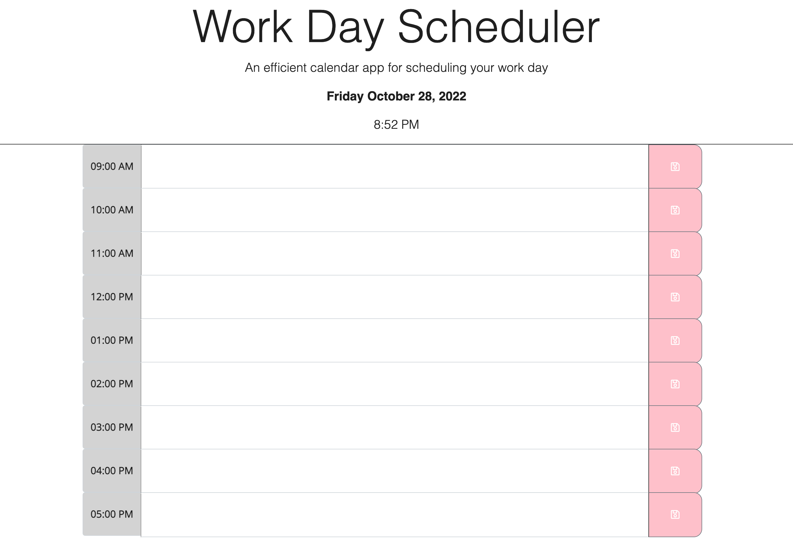

# Work Day Schedule

## Overview

In this project, i created an efficient calender app for scheduling an individuals work day.

This application will run in the browser and feature dynamically HTML and CSS powered by jQuery and Moment.js.

## Technologies

- HTML
- CSS
- JavaScript
- Moment.js
- JQuery

## Screen Shot

## Link

Github URL - https://github.com/ramlaahmed/workdayschedule

Deployed URL- https://ramlaahmed.github.io/workdayschedule/
